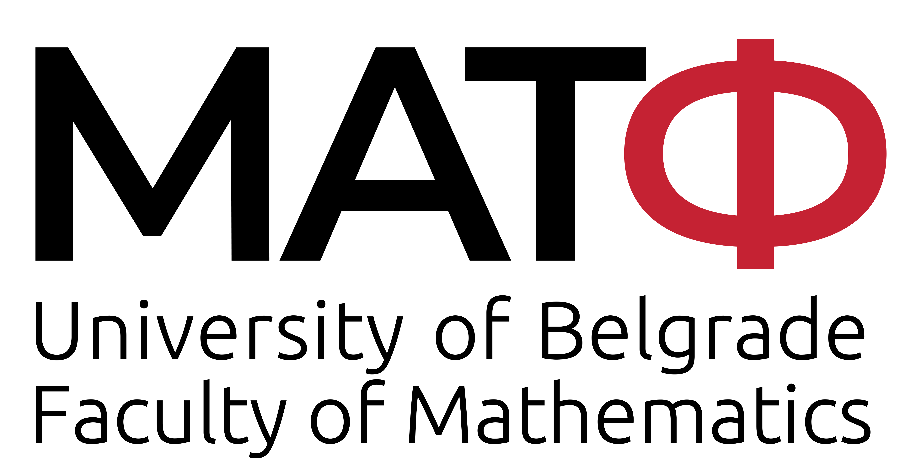
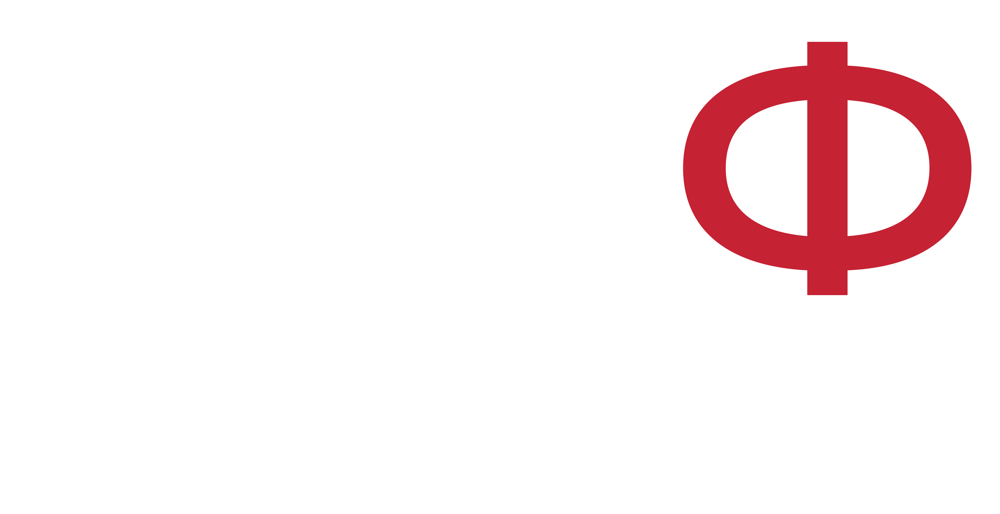
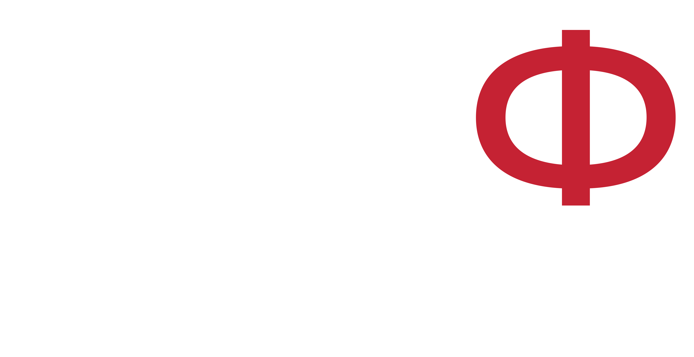
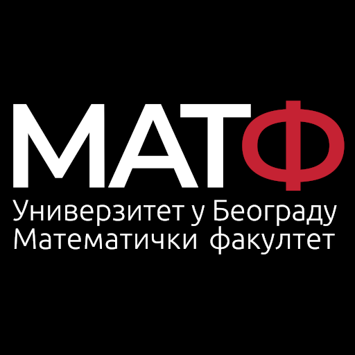
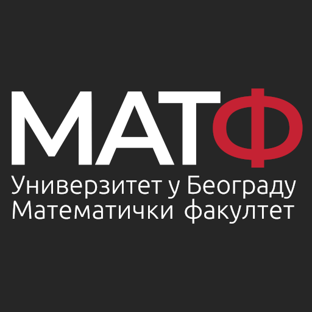
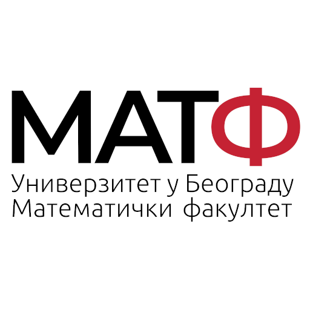
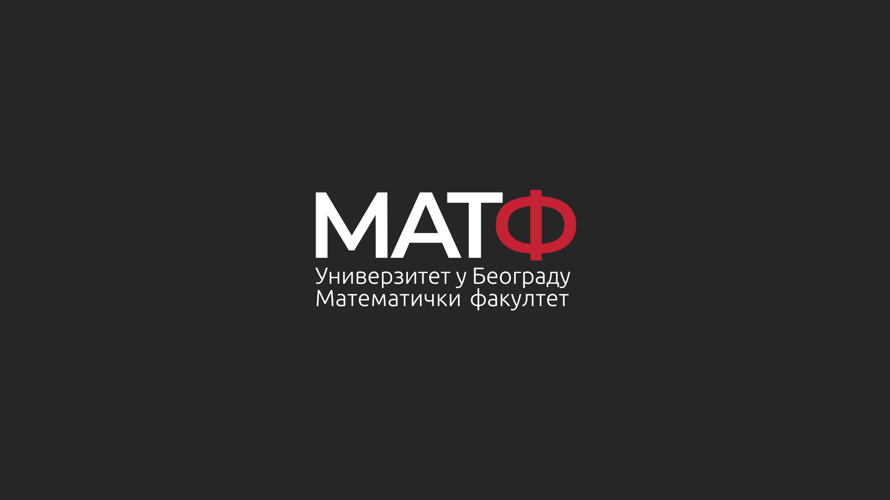
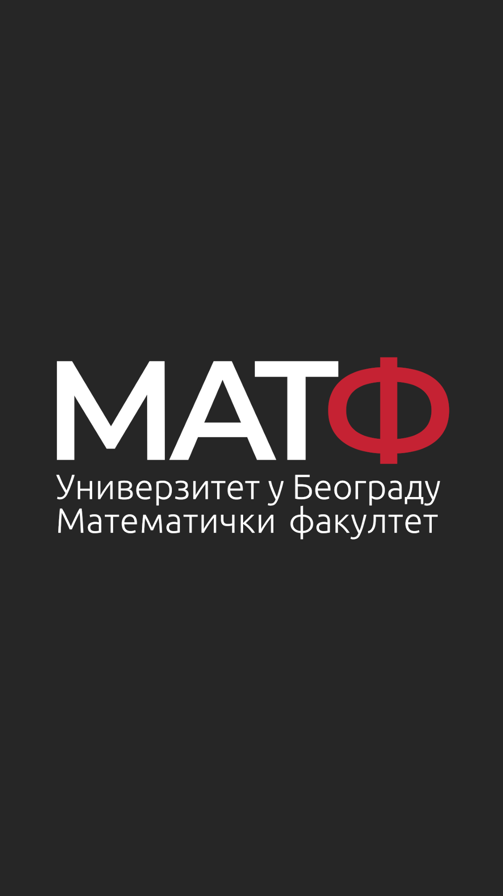
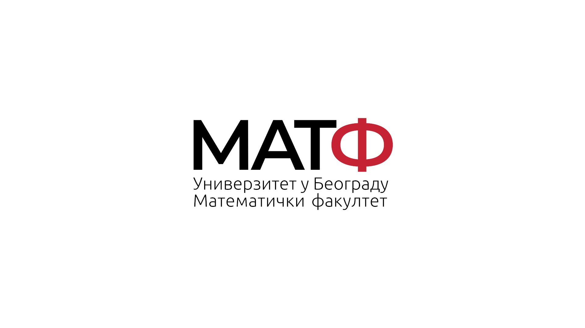
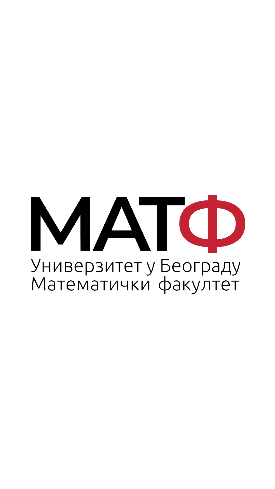

Faculty of Mathematics - Visual Identity
==============================================================

Just a repo I've created in order for me to keep all the
design materials for [Faculty of Mathematics](http://www.matf.bg.ac.rs/) I need to used accross multiple computers. Feel free to create new ones and send me to update this repository.

New visual identity is the work of [Marko Šerer](https://www.linkedin.com/in/marko-%C5%A1erer-a13578123/).

Logo
---------------

Version for light backgrounds.

Verion for dark backgrounds.

Some square based logos.

Dark wallpapers
--------------------

Both 16x9 and 16x10 versions are available.

You can also find a mobile version.

Light wallpapers
--------------------

Both 16x9 and 16x10 versions are available.

You can also find a mobile version.

